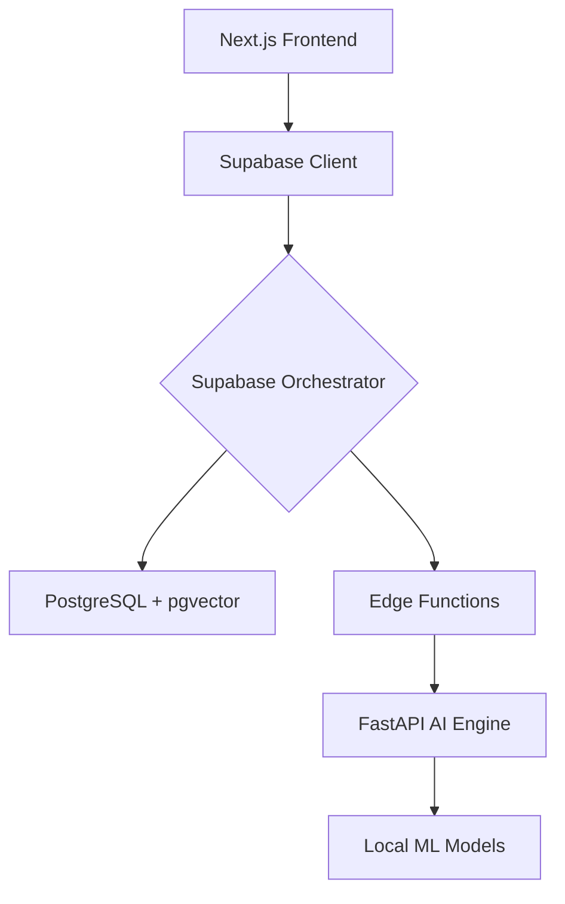

# 🏗️ API Architecture (Modern & Scalable)

**อัปเดตล่าสุด:** 2026-04-09
**หลักการสำคัญ:** Data-Centric Architecture & Edge Function First

---

## 📊 ภาพรวมสถาปัตยกรรม (High-Level View)

### **1. Presentation Layer (Next.js)**
- **Role:** จัดการ UI, User Interaction และ Orchestration ฝั่ง Client
- **Communication:** เรียกใช้ Supabase SDK เพื่อดึงข้อมูลจาก DB หรือเรียกใช้ Edge Functions

### **2. Orchestration Layer (Supabase Edge Functions)**
- **Role:** **เป็นที่เก็บ Business Logic ทั้งหมด** (ตามกฎ Project Constitution)
- **Key Functions:**
    - `hybrid-classification-local`: คำนวณหมวดหมู่สินค้าโดยผสม Keyword + Embedding
    - `generate-embeddings-local`: ประสานงานกับ AI Engine เพื่อสร้าง Vector
    - `hybrid-search`: ค้นหาข้อมูลแบบ Vector + Full-text Search

### **3. AI Engine Layer (FastAPI)**
- **Role:** เป็น **Embedding Provider** สำหรับการประมวลผล Heavy-lifting (GPU/CPU Intensive)
- **Endpoints:**
    - `POST /api/embed`: รับข้อความ → คืนค่า 384-dim Vector
    - `POST /api/embed/batch`: รับชุดข้อความ → คืนค่าชุด Vector
- **Note:** ไม่เก็บ Business Logic ใดๆ ในส่วนนี้ เพื่อความเป็นอิสระของข้อมูล

### **4. Data Layer (PostgreSQL + pgvector)**
- **Role:** เก็บข้อมูล Taxonomy, Products, Rules และ Vector Embeddings
- **Technology:** ใช้ `pgvector` สำหรับคำนวณ Cosine Similarity ภายในฐานข้อมูลโดยตรง

---

## 🔄 Interaction Scenarios (ตัวอย่างการทำงาน)

### **Scenario: การจำแนกหมวดหมู่ (Classification)**
1. **Frontend:** ส่งชื่อสินค้าภาษาไทยไปที่ `hybrid-classification-local` (Edge Function)
2. **Edge Function:**
    a. เรียก FastAPI (`/api/embed`) เพื่อเปลี่ยนชื่อสินค้าเป็น Vector
    b. ดึงข้อมูลจากตาราง `keyword_rules` และ `taxonomy_nodes` (Embedding) มาเปรียบเทียบ
    c. คำนวณคะแนน Hybrid (Keyword 60% + Embedding 40%)
    d. ส่งผลลัพธ์กลับให้ Frontend

### **Scenario: การนำเข้าสินค้า (Import Wizard)**
1. **Frontend:** อัปโหลดไฟล์ไปที่ Supabase Storage
2. **Next.js API Route:** อ่านไฟล์และส่งข้อมูลเข้าสู่คิวการประมวลผล
3. **Edge Function:** ประมวลผลแต่ละรายการ (Clean → Embed → Classify → Save)

---

## 🔐 Security & Access Control

- **Internal Service:** FastAPI รันอยู่ใน Private Network (หรือเข้าถึงได้ผ่าน Proxy)
- **Edge Functions:** ใช้ **Service Role Key** เมื่อต้องการข้าม RLS หรือ **Anon Key** สำหรับ User ทั่วไป
- **Row Level Security (RLS):** ปกป้องข้อมูลในตาราง `imports` และ `products` เพื่อความปลอดภัย

---

## 🎯 ประโยชน์ของสถาปัตยกรรมนี้

1.  **Maintainability:** Logic อยู่ในที่เดียว (Edge Functions) ง่ายต่อการอัปเดต
2.  **Scalability:** สามารถแยกส่วน AI Engine ไปรันบนเครื่องที่มี GPU โดยไม่กระทบส่วนอื่น
3.  **Cost-Effective:** ใช้ Local Model (384-dim) แทนการเสียเงินค่า API ภายนอก
4.  **Performance:** คำนวณ Vector Similarity ภายใน DB (pgvector) ช่วยให้ค้นหาได้รวดเร็วแม้ข้อมูลจำนวนมาก

---

**⚠️ กฎเหล็ก:** ห้ามเขียน Logic สำหรับ Classification ใหม่ๆ ลงใน FastAPI โดยเด็ดขาด ให้ย้ายมาอยู่ใน Edge Functions เพื่อความเป็นระเบียบตามรัฐธรรมนูญของโปรเจกต์
