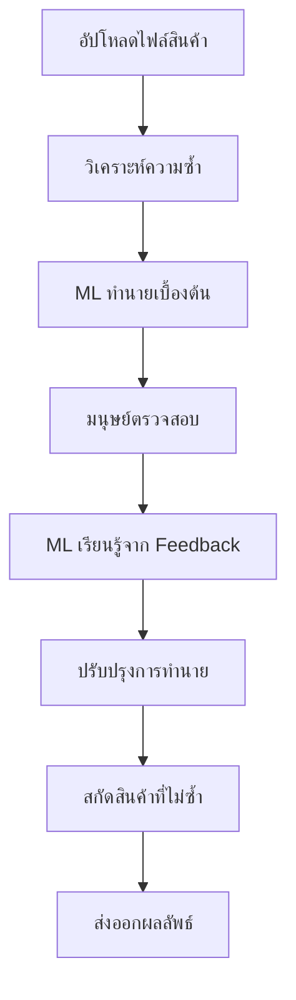

# 🤖 Human-in-the-Loop Product Deduplication System

ระบบหาสินค้าที่ไม่ซ้ำ และให้มนุษย์ตรวจสอบเพื่อให้ ML เรียนรู้

## 🎯 ความสามารถของระบบ

### 🔍 **การหาสินค้าที่ไม่ซ้ำ**
- วิเคราะห์ความคล้ายของสินค้าด้วย AI
- จัดกลุ่มสินค้าที่คล้ายกัน
- เลือกสินค้าตัวแทนจากแต่ละกลุ่ม
- รองรับภาษาไทยและอังกฤษ

### 👤 **ระบบตรวจสอบโดยมนุษย์**
- Web interface สำหรับให้มนุษย์ตรวจสอบ
- ระบบให้คะแนนและความคิดเห็น
- ติดตามประวัติการตรวจสอบ
- แสดงข้อมูลสถิติการทำงาน

### 🧠 **การเรียนรู้ของ ML**
- เรียนรู้จาก human feedback
- ปรับปรุงความแม่นยำอย่างต่อเนื่อง
- ประเมินประสิทธิภาพโมเดล
- รองรับโมเดลหลายประเภท

## 🚀 การติดตั้งและใช้งาน

### 1. ติดตั้ง Dependencies

```bash
pip install -r requirements.txt
```

### 2. วิเคราะห์สินค้า

```bash
# วิเคราะห์ความซ้ำของสินค้า
python complete_deduplication_pipeline.py --input products.csv --mode analyze --output analysis_result.json

# สกัดสินค้าที่ไม่ซ้ำ
python complete_deduplication_pipeline.py --input products.csv --mode extract --output unique_products.csv
```

### 3. ให้มนุษย์ตรวจสอบ

```bash
# เริ่มเซสชันตรวจสอบ
python complete_deduplication_pipeline.py --input products.csv --mode review --reviewer "ชื่อผู้ตรวจสอบ"
```

### 4. เทรนโมเดล ML

```bash
# เทรนโมเดลจาก human feedback
python complete_deduplication_pipeline.py --input products.csv --mode train
```

### 5. เริ่ม Web Interface

```bash
# เริ่ม API และ Web Interface
python complete_deduplication_pipeline.py --mode api --port 8000
```

## 📋 รูปแบบไฟล์ Input

### CSV Format
```csv
product_name
iPhone 14 Pro Max 256GB สีดำ
iPhone 14 Pro Max 256GB Black  
Samsung Galaxy S23 Ultra
Samsung Galaxy S23 Ultra 256GB
MacBook Pro 14 inch M2
MacBook Pro 14" M2 Chip
```

### Excel Format
รองรับไฟล์ .xlsx และ .xls ที่มีคอลัมน์ชื่อสินค้า

## 🎨 Web Interface

เข้าใช้งานผ่าน: `http://localhost:8000/web/human_review.html`

### ฟีเจอร์หลัก:
- 👤 ระบบล็อกอินผู้ตรวจสอบ
- 📊 แดชบอร์ดสถิติการทำงาน
- 🔍 หน้าจอเปรียบเทียบสินค้า
- 📝 ระบบให้ feedback แบบ 4 ระดับ:
  - **สินค้าซ้ำ** - สินค้าเดียวกัน
  - **คล้าย แต่ไม่ซ้ำ** - สินค้าใกล้เคียง
  - **ต่างกัน** - สินค้าต่างกัน
  - **ไม่แน่ใจ** - ต้องตรวจสอบเพิ่ม

## 🤖 ประเภทโมเดล ML

ระบบรองรับโมเดล ML หลายประเภท:

1. **Random Forest** (default)
   - เหมาะกับข้อมูลหลากหลาย
   - ให้ feature importance

2. **Gradient Boosting**
   - ความแม่นยำสูง
   - ใช้เวลาเทรนนานกว่า

3. **Logistic Regression**
   - รวดเร็ว และใช้หน่วยความจำน้อย
   - เหมาะกับข้อมูลขนาดใหญ่

## 📊 ฟีเจอร์ที่ใช้ในการเรียนรู้

1. **Similarity Features**
   - คะแนนความคล้าย (similarity score)
   - ความมั่นใจของระบบ (confidence score)

2. **Text Features**
   - ความยาวข้อความ
   - ความแตกต่างของความยาว
   - Character และ word overlap

3. **Language Features**
   - อัตราส่วนอักษรไทย/อังกฤษ
   - การมีตัวเลขในชื่อสินค้า

4. **Brand/Model Features**
   - ความคล้ายของแบรนด์
   - การตรงกันของรุ่นสินค้า

## 📈 การประเมินประสิทธิภาพ

### Metrics ที่ใช้:
- **Accuracy**: ความแม่นยำโดยรวม
- **Precision/Recall**: สำหรับแต่ละคลาส
- **Confusion Matrix**: แสดงรายละเอียดการทำนาย
- **Cross Validation**: ประเมินความเสถียร

### ตัวอย่างผลลัพธ์:
```
✅ การเทรนโมเดลสำเร็จ!
   ความแม่นยำ: 0.875
   Cross-validation: 0.863 ± 0.045
   ข้อมูลการเทรน: 156 รายการ
```

## 🗄️ โครงสร้างฐานข้อมูล

### Tables:
1. **product_comparisons**: เก็บการเปรียบเทียบและ feedback
2. **unique_products**: เก็บสินค้าที่ไม่ซ้ำ
3. **model_training_history**: ประวัติการเทรนโมเดล

## 📱 API Endpoints

### 1. ข้อมูลสถานะ
```http
GET /api/v1/status
```

### 2. วิเคราะห์สินค้า
```http
POST /api/v1/analyze
Content-Type: application/json

{
  "products": ["iPhone 14", "iPhone 14 Pro"],
  "threshold": 0.8
}
```

### 3. สกัดสินค้าที่ไม่ซ้ำ
```http
POST /api/v1/extract-unique
Content-Type: application/json

{
  "products": [...],
  "threshold": 0.8
}
```

## 🔧 การปรับแต่งขั้นสูง

### 1. เปลี่ยน Similarity Threshold
```bash
python complete_deduplication_pipeline.py --input products.csv --threshold 0.9 --mode analyze
```

### 2. ปรับขนาด Review Batch
```bash
python complete_deduplication_pipeline.py --input products.csv --mode review --batch-size 20
```

### 3. เลือกประเภทโมเดล
```python
from ml_feedback_learning import FeedbackLearningModel

model = FeedbackLearningModel(model_type="gradient_boosting")
```

## 📋 ตัวอย่างการใช้งาน

### 1. ไฟล์ products.csv
```csv
product_name
iPhone 14 Pro Max 256GB สีดำ
iPhone 14 Pro Max 256GB Black
iPhone 14 Pro Max 256GB ดำ  
Samsung Galaxy S23 Ultra
Samsung Galaxy S23 Ultra 256GB
Galaxy S23 Ultra 5G
MacBook Pro 14 inch M2
MacBook Pro 14" M2 Chip
MacBook Pro 14-inch M2
iPad Air 5th Generation
iPad Air 5 64GB WiFi
AirPods Pro 2nd Generation
```

### 2. คำสั่งวิเคราะห์
```bash
python complete_deduplication_pipeline.py \
  --input products.csv \
  --mode analyze \
  --threshold 0.8 \
  --output analysis.json
```

### 3. ผลลัพธ์ที่คาดหวัง
```
📊 ผลการวิเคราะห์:
   สินค้าทั้งหมด: 12 รายการ
   การเปรียบเทียบ: 15 คู่
   ความคล้ายสูง (≥0.9): 3 คู่
   ความคล้ายปานกลาง (0.7-0.9): 4 คู่
   ความคล้ายต่ำ (0.5-0.7): 8 คู่
   ต้องตรวจสอบโดยมนุษย์: 7 คู่

🤖 การทำนายของ ML:
   duplicate: 3 คู่
   similar: 4 คู่
   different: 8 คู่
```

### 4. สกัดสินค้าที่ไม่ซ้ำ
```bash
python complete_deduplication_pipeline.py \
  --input products.csv \
  --mode extract \
  --output unique_products.csv
```

### 5. ผลลัพธ์สุดท้าย
```
📦 ผลการสกัดสินค้าที่ไม่ซ้ำ:
   สินค้าเข้า: 12 รายการ
   สินค้าที่ไม่ซ้ำ: 8 รายการ
   อัตราการลดซ้ำ: 33.3%
   กลุ่มทั้งหมด: 8 กลุ่ม
   กลุ่มที่มีสินค้าเดียว: 5 กลุ่ม
   กลุ่มที่มีหลายสินค้า: 3 กลุ่ม
```

## 🛠️ Troubleshooting

### 1. โมเดลไม่สามารถเทรนได้
```
❌ การเทรนล้มเหลว: ต้องมี feedback อย่างน้อย 10 รายการสำหรับการเทรน
```
**วิธีแก้**: ให้มนุษย์ตรวจสอบและให้ feedback อย่างน้อย 10 รายการก่อน

### 2. ไม่พบคอลัมน์ที่มีชื่อสินค้า
```
❌ ไม่สามารถระบุคอลัมน์ที่มีชื่อสินค้าได้
```
**วิธีแก้**: ระบุชื่อคอลัมน์ด้วย `--column "ชื่อคอลัมน์"`

### 3. Web Interface ไม่แสดงผล
**วิธีแก้**: 
1. ตรวจสอบ port ว่าถูกใช้งานหรือไม่
2. เปลี่ยน port: `--port 8080`
3. ตรวจสอบ firewall settings

## 📚 สรุป Workflow



## 🎯 ประโยชน์ของระบบ

1. **ลดการซ้ำซ้อน**: หาสินค้าที่ซ้ำกันโดยอัตโนมัติ
2. **ประหยัดเวลา**: ลดภาระการตรวจสอบด้วยตนเอง
3. **เรียนรู้ต่อเนื่อง**: ระบบฉลาดขึ้นเรื่อยๆ จาก feedback
4. **ความแม่นยำสูง**: รวมความสามารถ AI และมนุษย์
5. **รองรับภาษาไทย**: เข้าใจบริบทภาษาไทยได้ดี

---

💡 **หมายเหตุ**: ระบบนี้ออกแบบมาเพื่อการเรียนรู้และปรับปรุงอย่างต่อเนื่อง ยิ่งใช้งานมาก ML จะยิ่งแม่นยำมากขึ้น!
