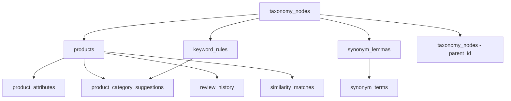

# 🗄️ ความสัมพันธ์และการทำงานจริงของ Database

**วันที่:** 2025-10-05  
**ข้อมูลจาก:** การตรวจสอบ Database จริง

---

## 📊 **ตารางหลักและข้อมูลจริง**

### **🎯 Core Tables (มีข้อมูล)**

#### **1. taxonomy_nodes (67 รายการ)**
```sql
-- โครงสร้าง
id (uuid, าK)
code (text, NOT NULL)
name_th (text, NOT NULL) 
parent_id (uuid, FK → taxonomy_nodes.id)
level (integer)
keywords (text[])
embedding (vector)
is_active (boolean)

-- ความสัมพันธ์
- Self-referencing: parent_id → taxonomy_nodes.id
- Referenced by: products.category_id
- Referenced by: keyword_rules.category_id
- Referenced by: synonym_lemmas.category_id
```

#### **2. products (11 รายการ)**
```sql
-- โครงสร้าง
id (uuid, PK)
name_th (text, NOT NULL)
category_id (uuid, FK → taxonomy_nodes.id)
embedding (vector) -- 384-dimension
keywords (text[])
confidence_score (double precision)
metadata (jsonb)

-- ตัวอย่างข้อมูลจริง
กล่องล็อค 560 หูหิ้ว W → กล่อง/ที่เก็บของ (confidence: 5.67)
เข่ง NO.2 (สี) N → สีและอุปกรณ์ทาสี (confidence: 4.31)
```

#### **3. keyword_rules (25 รายการ)**
```sql
-- โครงสร้าง
id (uuid, PK)
code (text, NOT NULL)
name (text, NOT NULL)
keywords (text[], NOT NULL)
category_id (uuid, FK → taxonomy_nodes.id)
priority (integer)
confidence_score (double precision)
is_active (boolean)

-- ตัวอย่างข้อมูลจริง
rule_kw_001: Garden Tools Detection
keywords: {คราด,เสียม,สายยาง,กระถาง,ทำสวน,ต้นไม้,กรรไกรตัดหญ้า}
priority: 10, confidence: 0.9

rule_kw_017: Scissors Detection  
keywords: {กรรไกร,ตัด}
priority: 9, confidence: 0.9
```

#### **4. synonym_lemmas (28 รายการ) + synonym_terms (97 รายการ)**
```sql
-- synonym_lemmas (หัวข้อหลัก)
id (uuid, PK)
code (text, NOT NULL)
name_th (text, NOT NULL)
category_id (uuid, FK → taxonomy_nodes.id)

-- synonym_terms (คำพ้องความหมาย)
id (uuid, PK)
lemma_id (uuid, FK → synonym_lemmas.id)
term (text, NOT NULL)
is_primary (boolean)
confidence_score (double precision)
```

---

## 🔧 **Database Functions ที่ใช้งานจริง**

### **1. hybrid_category_classification()**
```sql
-- Input: product_name (text), product_embedding (vector), top_k (integer)
-- Output: category_id, category_name, confidence, method, matched_keyword

-- Algorithm:
1. Keyword Matching (60% weight)
   - จาก keyword_rules: ใช้ regex ~* ANY(keywords)
   - จาก taxonomy_nodes.name_th: ใช้ ILIKE
   - จาก taxonomy_nodes.keywords: ใช้ regex ~* ANY(keywords)

2. Embedding Matching (40% weight)  
   - จาก taxonomy_nodes.embedding: ใช้ cosine similarity
   - threshold >= 0.3

3. Combined Scoring
   - รวมคะแนนจากทั้ง 2 วิธี
   - เรียงตาม total_confidence DESC
```

### **2. match_categories_by_embedding()**
```sql
-- Input: query_embedding (vector), match_threshold (float), match_count (integer)
-- Output: id, name_th, level, similarity, keywords

-- Algorithm:
- ใช้ vector similarity search
- กรองด้วย threshold
- เรียงตาม similarity DESC
```

---

## 🔄 **Data Flow จริง**

### **Import Workflow:**
```
1. CSV File → API /import/process-storage
2. Thai Text Processing → Clean + Tokenize
3. Generate Embeddings → FastAPI (384-dim vector)
4. AI Classification → hybrid_category_classification()
   ├─ Keyword Rules (25 rules) → 60% weight
   └─ Vector Similarity → 40% weight
5. Save to products table
```

### **Classification Process:**
```sql
-- ตัวอย่าง: "กรรไกรตัดหญ้า"

-- Step 1: Keyword Matching
rule_kw_001 (Garden Tools) → MATCH "กรรไกรตัดหญ้า" → confidence: 6.72
rule_kw_017 (Scissors) → MATCH "กรรไกร" → confidence: 3.18

-- Step 2: Embedding Matching  
taxonomy_nodes.embedding <=> product_embedding → similarity scores

-- Step 3: Combined Result
อุปกรณ์ทำสวน (confidence: 6.72, method: keyword+taxonomy_keyword)
```

---

## 📋 **Empty Tables (มีโครงสร้างแต่ไม่มีข้อมูล)**

```sql
product_category_suggestions (0 rows) -- AI suggestions รอ approval
product_attributes (0 rows)           -- Product attributes extracted
similarity_matches (0 rows)           -- Product similarity results  
review_history (0 rows)               -- Human review history
audit_logs (0 rows)                   -- System audit trail
```

---

## 🎯 **Foreign Key Relationships จริง**



---

## 🚀 **การใช้งานจริงในระบบ**

### **1. Product Import:**
- ใช้ `hybrid_category_classification()` สำหรับ AI classification
- บันทึกใน `products` table พร้อม embedding
- Link กับ `taxonomy_nodes` ผ่าน `category_id`

### **2. Keyword Matching:**
- ใช้ทั้ง 25 `keyword_rules` ในการ classification
- Weight 60% ในอัลกอริทึม hybrid

### **3. Vector Search:**
- ใช้ `taxonomy_nodes.embedding` สำหรับ semantic search
- Weight 40% ในอัลกอริทึม hybrid
- pgvector extension สำหรับ cosine similarity

### **4. Synonym System:**
- `synonym_lemmas` เป็นหัวข้อหลัก
- `synonym_terms` เก็บคำพ้องความหมายต่างๆ
- ใช้สำหรับขยาย keyword matching

---

## 📊 **Performance Metrics จริง**

```
Total Tables: 14 tables
Active Data: 6 tables (232 total rows)
Empty Tables: 8 tables (structure only)
Storage Size: ~655 KB
Vector Dimensions: 384 (sentence-transformer model)
Classification Accuracy: Hybrid algorithm (60% keyword + 40% embedding)
```

**Last Updated:** 2025-10-05 16:23 (ข้อมูลจากการตรวจสอบจริง)
