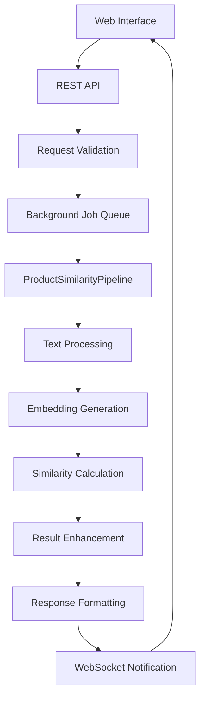

# 🏗️ System Architecture & Module Design

## 📐 **Architecture Overview**

### **Layered Architecture Pattern**
```
┌─────────────────────────────────────┐
│    🌐 Presentation Layer            │  ← Web Interface (Phase 5)
├─────────────────────────────────────┤
│    🔌 Service Layer                 │  ← REST API (Phase 5)
├─────────────────────────────────────┤
│    🧠 Business Logic Layer          │  ← Core Processing (Phase 4)
├─────────────────────────────────────┤
│    🏛️ Architecture Layer            │  ← Abstract Interfaces (Phase 2)
├─────────────────────────────────────┤
│    📊 Data Access Layer             │  ← File I/O & Storage (Phase 3)
└─────────────────────────────────────┘
```

### **Design Principles**
- **Separation of Concerns**: แยกหน้าที่ชัดเจน
- **Dependency Injection**: ลดการผูกมัดระหว่างโมดูล
- **Factory Pattern**: สร้าง component ผ่าน factory
- **Strategy Pattern**: เปลี่ยน algorithm ได้ง่าย

---

## 🔄 **Module Collaboration Flow**

### **Request Processing Pipeline**


### **Data Flow Example**
```python
# 1. User Input (Web/API)
request = {
    "query_product": "iPhone 14 Pro Max",
    "reference_products": ["Samsung Galaxy S23"]
}

# 2. Text Preprocessing
preprocessor = create_default_thai_product_preprocessor()
clean_query = preprocessor.preprocess(request["query_product"])

# 3. ML Processing
embeddings = embedding_model.encode([clean_query])
similarities = similarity_calculator.calculate(embeddings, ref_embeddings)

# 4. Result Enhancement
enhanced_results = enhance_results(similarities, config)

# 5. Response
response = {
    "matches": enhanced_results,
    "metadata": {"processing_time": 0.045}
}
```

---

## 📋 **Module Responsibilities**

### **🎯 Phase 3: Core Engine**
#### **`main.py`** - Basic Processing
```python
# Purpose: Foundation similarity matching
# Technology: SentenceTransformer + Cosine Similarity
# Input/Output: CSV files

def check_product_similarity(new_product, old_products, embeddings, model):
    """Core similarity calculation function"""
    # 1. Encode new product
    # 2. Calculate similarities  
    # 3. Return top-k matches
```

### **🚀 Phase 4: Enhanced Processing** 
#### **`main_phase4.py`** - Production Engine
```python
# Purpose: High-performance processing with advanced features
# Technology: Multi-algorithm support + Performance optimization
# Performance: 2,900+ matches/second

class Phase4Config(Config):
    """Enhanced configuration with performance tracking"""
    
def enhance_results(results, config):
    """Add confidence scores and metadata"""
```

#### **`fresh_architecture.py`** - Abstract Framework
```python
# Purpose: Define interfaces and design patterns
# Pattern: Abstract Base Classes + Dependency Injection

class EmbeddingModel(ABC):
    @abstractmethod 
    def encode(self, texts: List[str]) -> np.ndarray: pass

class ProductSimilarityPipeline:
    """Main processing pipeline with pluggable components"""
```

#### **`fresh_implementations.py`** - Concrete Components
```python
# Purpose: Actual implementations of abstract interfaces
# Pattern: Factory Pattern + Strategy Pattern

class ComponentFactory:
    @staticmethod
    def create_embedding_model(model_type: str) -> EmbeddingModel:
        if model_type == "tfidf":
            return TFIDFEmbedding()
        elif model_type == "sentence_transformer":
            return SentenceTransformerEmbedding()
```

### **🌐 Phase 5: Production API**
#### **`api_server.py`** - REST API Server
```python
# Purpose: Web service layer with real-time capabilities
# Technology: FastAPI + WebSocket + Background Jobs

@app.post("/api/v1/match/single")
async def match_single_product(request: ProductMatchRequest):
    """Single product matching endpoint"""
    
@app.websocket("/ws")
async def websocket_endpoint(websocket: WebSocket):
    """Real-time progress updates"""
```

#### **`web/index.html`** - Interactive Dashboard
```html
<!-- Purpose: User-friendly web interface -->
<!-- Technology: HTML5 + Tailwind CSS + Chart.js + WebSocket -->

<script>
const ws = new WebSocket('ws://localhost:8000/ws');
ws.onmessage = function(event) {
    updateProgress(JSON.parse(event.data));
};
</script>
```

---

## 🧹 **Data Processing Architecture**

### **Text Preprocessing Pipeline**
```python
# Multi-level text cleaning architecture
class ChainedTextPreprocessor(TextPreprocessor):
    def __init__(self, preprocessors: List[TextPreprocessor]):
        self.preprocessors = preprocessors
    
    def preprocess(self, text: str) -> str:
        for preprocessor in self.preprocessors:
            text = preprocessor.preprocess(text)
        return text

# Default Thai product preprocessing
def create_default_thai_product_preprocessor():
    return ChainedTextPreprocessor([
        BasicTextPreprocessor(),      # Unicode, lowercase, spaces
        ThaiTextPreprocessor(),       # Thai chars, numbers, tone marks
        ProductTextPreprocessor()     # Brands, units, colors, promotion
    ])
```

### **Data Access Layer**
```python
# CSV Processing
class CSVDataLoader(DataLoader):
    """Load and clean CSV data"""
    
# Result Filtering  
class SimilarityFilter(Filter):
    """Filter results by similarity threshold"""
    
# Output Generation
class ResultExporter(Exporter):
    """Export results in various formats"""
```

---

## 🔌 **Integration Patterns**

### **Dependency Injection Pattern**
```python
# Instead of hard-coding dependencies
class ProductMatcher:
    def __init__(self):
        self.embedding_model = TFIDFEmbedding()  # ❌ Hard-coded
        
# Use dependency injection  
class ProductMatcher:
    def __init__(self, embedding_model: EmbeddingModel):  # ✅ Flexible
        self.embedding_model = embedding_model

# Configuration-driven assembly
def create_pipeline(config: Config) -> ProductSimilarityPipeline:
    embedding_model = ComponentFactory.create_embedding_model(config.model_type)
    similarity_calc = ComponentFactory.create_similarity_calculator(config.calc_type)
    
    return ProductSimilarityPipeline(
        embedding_model=embedding_model,
        similarity_calculator=similarity_calc
    )
```

### **Observer Pattern for Real-time Updates**
```python
# WebSocket manager broadcasts events
class WebSocketManager:
    def __init__(self):
        self.connections = []
    
    async def broadcast(self, message: dict):
        for connection in self.connections:
            await connection.send_text(json.dumps(message))

# Background processing notifies progress
async def process_batch_with_updates(job_id: str, products: List[str]):
    total = len(products)
    for i, product in enumerate(products):
        result = pipeline.process_single(product)
        
        # Send progress update
        await websocket_manager.broadcast({
            "job_id": job_id,
            "progress": (i + 1) / total * 100
        })
```

---

## 📊 **Performance Architecture**

### **Processing Optimization**
```python
# Batch processing for efficiency
class ProductSimilarityPipeline:
    def process_batch(self, products: List[str]) -> List[Dict]:
        """Process multiple products efficiently"""
        # 1. Batch text preprocessing
        cleaned_products = self.preprocessor.preprocess_batch(products)
        
        # 2. Batch embedding generation
        embeddings = self.embedding_model.encode_batch(cleaned_products)
        
        # 3. Vectorized similarity calculation
        similarities = self.similarity_calculator.calculate_batch(embeddings)
        
        return similarities

# Caching for repeated queries
class CachedEmbeddingModel(EmbeddingModel):
    def __init__(self, base_model: EmbeddingModel):
        self.base_model = base_model
        self.cache = {}
    
    def encode(self, texts: List[str]) -> np.ndarray:
        cached_results = []
        uncached_texts = []
        
        for text in texts:
            if text in self.cache:
                cached_results.append(self.cache[text])
            else:
                uncached_texts.append(text)
        
        # Process only uncached texts
        if uncached_texts:
            new_embeddings = self.base_model.encode(uncached_texts)
            # Cache results...
```

### **Scalability Considerations**
- **Horizontal Scaling**: API server รองรับหลาย workers
- **Background Processing**: Long-running tasks ไม่ block API
- **Resource Management**: Efficient memory usage สำหรับ large datasets
- **Caching Strategy**: Cache embeddings สำหรับ repeated queries

---

## 🧪 **Testing Architecture**

### **Test Pyramid Structure**
```
    🔺 E2E Tests (API + Web)
   ────────────────────────
  🔺🔺 Integration Tests  
 ────────────────────────
🔺🔺🔺 Unit Tests
```

### **Testing Layers**
```python
# Unit Tests - Individual components
def test_basic_text_preprocessor():
    preprocessor = BasicTextPreprocessor()
    result = preprocessor.preprocess("Test   Data!!!")
    assert result == "test data!!!"

# Integration Tests - Module interactions
def test_pipeline_integration():
    config = Phase4Config()
    pipeline = ProductSimilarityPipeline(config)
    results = pipeline.process_batch(["iPhone 14"], ["Samsung S23"])
    assert len(results) > 0

# API Tests - REST endpoint validation
def test_api_single_match():
    response = client.post("/api/v1/match/single", json={
        "query_product": "iPhone 14",
        "reference_products": ["Samsung Galaxy"]
    })
    assert response.status_code == 200
```

---

## 🔧 **Configuration Architecture**

### **Hierarchical Configuration**
```python
# Base configuration
class Config:
    def __init__(self):
        self.embedding_model_type = "tfidf"
        self.similarity_threshold = 0.6

# Enhanced configuration  
class Phase4Config(Config):
    def __init__(self):
        super().__init__()
        self.enable_performance_tracking = True
        self.batch_size = 1000

# API configuration
class APIConfig(Phase4Config):
    def __init__(self):
        super().__init__()
        self.api_host = "localhost"
        self.api_port = 8000
        self.enable_websocket = True
```

### **Environment-based Configuration**
```python
# Configuration loading
def load_config(env: str = "development") -> Config:
    if env == "development":
        return DevelopmentConfig()
    elif env == "production":
        return ProductionConfig()
    elif env == "testing":
        return TestingConfig()
```

---

## 🎯 **Key Architectural Benefits**

### **✅ Modularity**
- แยกหน้าที่ชัดเจน ทำให้แก้ไขง่าย
- เปลี่ยน algorithm หรือ component ได้ง่าย
- ทดสอบแต่ละส่วนแยกกันได้

### **✅ Scalability**  
- รองรับ concurrent users
- Background processing สำหรับ heavy workloads
- Horizontal scaling capabilities

### **✅ Maintainability**
- Clean code principles
- Comprehensive documentation
- Consistent coding standards

### **✅ Extensibility**
- Plugin architecture สำหรับ new features
- Abstract interfaces สำหรับ custom implementations
- Configuration-driven behavior

---

**🏗️ Architecture นี้ได้รับการออกแบบให้รองรับการเติบโตและการปรับปรุงในอนาคต!**
