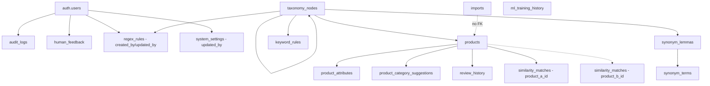

# 🗄️ ความสัมพันธ์และการทำงานจริงของ Database

**วันที่:** 2026-08-25 (แทนที่เวอร์ชัน 2025-10-05 ที่ล้าสมัย)
**ข้อมูลจาก:** ตรวจสอบ Edge Functions, config.toml, migrations (ถึง `20260822000003`) และโค้ด backend จริง (`src/api/routers/classify.py`, `internal_match.py`, `embed.py`, `src/core/advanced_models.py`) + `taxonomy-app/schema_export.sql`

> **หมายเหตุ:** เอกสารนี้เน้น "ความสัมพันธ์ระหว่างตาราง" และ "ลำดับการทำงานจริง" — ดูรายละเอียด column/RLS ครบทุกตารางที่ `DATABASE_SCHEMA.md`

---

## ⚠️ สิ่งที่เอกสารเดิม (2025-10-05) ผิดหรือขาด

| ประเด็น | เดิมบอกว่า | ความจริง |
|---|---|---|
| จำนวนตาราง | 14 ตาราง | **15 ตาราง** — ขาด `regex_rules`, `human_feedback`, `ml_training_history` |
| `products.embedding` | บอกว่าเป็น 384-dim อยู่แล้ว | ตอนตรวจจริงเป็น **768-dim** (schema drift) ทำให้ dedup endpoint (`internal_match.py:685`) crash — **แก้แล้ว 22 ส.ค. 2026** กลับเป็น 384-dim |
| ความสัมพันธ์ products ↔ products | ไม่ได้พูดถึงชัดเจนว่าเป็นคนละ pipeline กับ classification | ยืนยันแล้วว่า **แยกกันคนละ pipeline** (ดูหัวข้อด้านล่าง) |
| Diagram FK ของ `product_attributes`/`product_category_suggestions`/`review_history`/`similarity_matches` | วาดลูกศรจาก `products` ตรงๆ แบบเดียว | ถูกทิศทาง แต่ขาดตารางที่เชื่อมกับ `auth.users` (audit_logs, human_feedback, regex_rules, system_settings) และขาด `imports`, `ml_training_history` ที่ไม่มี FK เชื่อมกับใครเลย |

---

## 🎯 ประเด็นที่เคยเป็นคำถามเปิด (ตอนนี้ยืนยันแล้ว)

**คำถามเดิม:** "ระบบตรวจหาสินค้าซ้ำก่อน แล้วค่อยนำมาจัดหมวดหมู่โดยใช้สินค้าที่จัดหมวดแล้วเป็นตัวอ้างอิง ใช่ไหม?"

**คำตอบจากโค้ดจริง: ไม่ใช่ — เป็นคนละ pipeline กัน ไม่ได้ป้อนผลให้กัน**

1. **Classification** (`src/api/routers/classify.py` → `hybrid_category_classification()`)
   เทียบ embedding ของสินค้าใหม่กับ **`taxonomy_nodes.embedding` เท่านั้น** (หมวดหมู่ ไม่ใช่สินค้าอื่น) — ไม่เคย query ตาราง `products` เลยในขั้นตอนนี้

2. **Deduplication** (`src/api/routers/internal_match.py` → endpoint `/import-dedup`)
   เทียบ embedding ของสินค้าใหม่กับ `products` ที่ `status = 'approved'` เท่านั้น — คนละคำถาม คนละตาราง คนละจุดประสงค์ (หาของซ้ำ ไม่ใช่หาหมวดหมู่)

ทั้งสอง pipeline รันได้อิสระจากกัน ผลของ dedup ไม่ถูกใช้เป็น input ของ classification และในทางกลับกัน

---

## 📊 **ตารางหลักและข้อมูลจริง**

### **🎯 Core Tables (มีข้อมูล ณ การตรวจครั้งล่าสุดที่นับได้ — บางตัวเลขอาจไม่ทันสมัยแล้ว ดู `DATABASE_SCHEMA.md` §Data Storage สำหรับตารางที่ยัง "ไม่ทราบ")**

#### **1. taxonomy_nodes (67 รายการ)**
```sql
id (uuid, PK)
code (text, UNIQUE)
name_th (text, NOT NULL)
parent_id (uuid, FK → taxonomy_nodes.id, ON DELETE CASCADE)
level (integer)
keywords (text[])
embedding (vector(384))   -- ถูกต้องตามสเปกมาตั้งแต่แรก ไม่เคยเป็นปัญหา
is_active (boolean)

-- ความสัมพันธ์
- Self-referencing: parent_id → taxonomy_nodes.id
- Referenced by: products.category_id
- Referenced by: keyword_rules.category_id (CASCADE)
- Referenced by: regex_rules.category_id (RESTRICT — ไม่สม่ำเสมอกับ keyword_rules)
- Referenced by: synonym_lemmas.category_id (SET NULL)
```

#### **2. products (11 รายการ)**
```sql
id (uuid, PK)
name_th (text, NOT NULL)
category_id (uuid, FK → taxonomy_nodes.id)
embedding (vector(384))   -- ✅ แก้จาก 768 → 384 แล้ว (migration 20260822000000)
keywords (text[])
status (text)             -- 'pending' | 'approved' | 'rejected'
import_batch_id (uuid)    -- ⚠️ ไม่มี FK constraint จริงไปยัง imports.id (ยังไม่แก้)
confidence_score (double precision)
metadata (jsonb)
```
`status='approved'` คือเงื่อนไขที่ `internal_match.py` ใช้กรองตอนหาสินค้าซ้ำ — สินค้าที่ยัง `pending` จะไม่ถูกใช้เป็นตัวเทียบ

#### **3. keyword_rules (25 รายการ)**
```sql
id (uuid, PK)
keywords (text[], NOT NULL)
category_id (uuid, FK → taxonomy_nodes.id, ON DELETE CASCADE)
priority (integer)
confidence_score (double precision)
```
ใช้ในขั้น keyword matching (60% weight) ของ `hybrid_category_classification()`

#### **4. synonym_lemmas (28 รายการ) + synonym_terms (97 รายการ)**
```sql
-- synonym_lemmas
category_id (uuid, FK → taxonomy_nodes.id, ON DELETE SET NULL)

-- synonym_terms
lemma_id (uuid, FK → synonym_lemmas.id, ON DELETE CASCADE)
term (text, NOT NULL)
```

---

## 🔧 **Database Functions ที่ใช้งานจริง**

### **1. hybrid_category_classification()** — ใช้ตอน import สินค้าใหม่
```
Input: product_name, product_embedding, top_k
Algorithm:
1. Keyword Matching (60%) — keyword_rules (regex) + taxonomy_nodes.name_th (ILIKE) + taxonomy_nodes.keywords
2. Embedding Matching (40%) — cosine similarity กับ taxonomy_nodes.embedding เท่านั้น (threshold >= 0.3)
3. รวมคะแนน เรียง confidence DESC
```
**แก้แล้ว 22 ส.ค. 2026** (`20260822000002_fix_hybrid_classification_ambiguous_column.sql`): ล็อก parameter เป็น `vector(384)` ตรงๆ (เดิมรับ `vector` แบบไม่ระบุมิติ) — กัน dimension mismatch แบบ silent fail ในอนาคต และแก้บั๊ก "ambiguous column" จาก subquery alias `all_matches`

### **2. match_products_by_embedding()** — ⭐ ใหม่ (`20260822000001`)
```
Input: query_embedding vector(384), match_threshold, match_count
```
ใช้สำหรับ dedup — comment ในไฟล์ migration ระบุว่าเป็นฟังก์ชันที่ `app/api/import/process/route.ts` เรียกใช้อยู่แล้วในโค้ด แต่ไม่เคยถูกสร้างจริงในฐานข้อมูลมาก่อน (ตรวจพบระหว่างแก้ embedding dimension)

### **3. match_categories_by_embedding()**
ใช้ semantic search แบบ standalone (ไม่ใช่ส่วนของ hybrid classification โดยตรง) — เทียบ `query_embedding` กับ `taxonomy_nodes.embedding`

### **exec_sql() — ❌ ลบทิ้งแล้ว (22 ส.ค. 2026)**
เคยเป็นฟังก์ชัน `SECURITY DEFINER` รัน SQL ใดก็ได้แบบไม่ auth — ยืนยันไม่ได้ใช้งานจริงก่อนลบ (`20260822000003_drop_exec_sql_function.sql`)

---

## 🔄 **Data Flow จริง (Import Workflow)**

```
1. USER upload CSV
2. Auth Gate — middleware.ts (⭐ ใหม่ 22 ส.ค. 2026)
   ต้องมี session cookie จาก POST /api/unlock (shared secret) ก่อน
   ทุก request ที่ไม่ใช่ GET/HEAD/OPTIONS โดน 401 ถ้าไม่มี cookie valid
3. Next.js API route (/api/import/process[-local|-storage])
   → สร้างแถวใน imports, parse CSV
4. ต่อ 1 สินค้า:
   a. ThaiTextProcessor: clean + tokenize
   b. Edge Function generate-embeddings-local → FastAPI /api/embed
      → paraphrase-multilingual-MiniLM-L12-v2 → embedding 384-dim
      (Edge Function เป็นแค่ proxy ไป FastAPI ไม่มี business logic เอง)
   c. Edge Function hybrid-classification-local → FastAPI /api/classify/category
      → hybrid_category_classification() เทียบกับ taxonomy_nodes เท่านั้น
5. บันทึกลง products (พร้อม category_id, embedding, status='pending')
   + product_category_suggestions (ตัวเลือกสำรอง, ยังว่างอยู่จริง — ไม่ยืนยันว่า UI ใช้)
   + audit_logs (ผ่าน trigger อัตโนมัติ)
6. Dedup check (แยก pipeline จาก step 4c โดยสิ้นเชิง)
   → เทียบ embedding สินค้าใหม่กับ products ที่ status='approved'
   → match_products_by_embedding() หรือ internal_match.py /import-dedup
   → บันทึกคู่ที่คล้ายกันลง similarity_matches
7. [ออกแบบไว้แต่ยังไม่ยืนยันว่าทำงานจริง] User review → approve/reject → review_history
   (review_history มี 0 แถวมาตลอด)
```

---

## 📋 **Empty Tables (มีโครงสร้างแต่ไม่มีข้อมูล ณ ตรวจครั้งล่าสุด)**

```
product_category_suggestions   -- AI suggestions รอ approval, ยังไม่ยืนยันว่า UI เชื่อม
product_attributes             -- Product attributes extracted
similarity_matches             -- dedup ยังไม่เคยรันจริง (แต่ตอนนี้ฟังก์ชันใช้งานได้แล้วหลังแก้ dimension)
review_history                 -- ยังไม่มีใคร approve ผ่านระบบ
audit_logs                     -- ยังไม่มี event เกิดขึ้น
```

---

## 🎯 **Foreign Key Relationships จริง (ครบ 15 ตาราง)**



**ตารางที่ไม่มี FK เชื่อมกับตารางหลักเลย (โดดเดี่ยวเชิงโครงสร้าง):** `imports` (แม้ `products.import_batch_id` จะมีข้อมูล UUID แต่ไม่ใช่ FK จริง), `ml_training_history`

**FK ที่ ON DELETE ไม่สม่ำเสมอกัน (ควรทบทวน):** `keyword_rules.category_id` = CASCADE แต่ `regex_rules.category_id` = RESTRICT (ไม่ระบุ)

---

## 🚀 **การใช้งานจริงในระบบ**

### **1. Product Import**
- `hybrid_category_classification()` สำหรับจัดหมวดหมู่ (เทียบ `taxonomy_nodes` เท่านั้น)
- บันทึกใน `products` พร้อม `category_id`, `embedding(384)`

### **2. Keyword Matching**
- 25 `keyword_rules`, weight 60% ในอัลกอริทึม hybrid

### **3. Vector Search / Classification**
- `taxonomy_nodes.embedding` — semantic match กับหมวดหมู่ (weight 40%)
- pgvector cosine similarity, ivfflat index

### **4. Deduplication (คนละ pipeline จากข้อ 3)**
- เทียบ `products.embedding` ใหม่กับ `products.embedding` เก่าที่ `status='approved'`
- ผ่าน `match_products_by_embedding()` (SQL) หรือ `internal_match.py` (FastAPI) — ทั้งคู่ใช้ได้จริงแล้วหลังแก้ dimension mismatch

### **5. Synonym System**
- `synonym_lemmas` (หัวข้อหลัก) → `synonym_terms` (คำพ้องความหมาย) — ใช้ขยาย keyword matching

### **6. Auth Gate (⭐ ใหม่)**
- `middleware.ts` กันทุก non-GET request บน `/api/*` ยกเว้น `/api/unlock`
- `/api/unlock` ปลดล็อกด้วย shared secret (constant-time compare, rate-limit 5/60s), ออก session cookie httpOnly 30 วัน — ออกแบบมาสำหรับใช้ในวง LAN ออฟฟิศ ไม่ใช่ auth ระดับ production สาธารณะ

---

## 🛡️ ความปลอดภัยที่แก้ไปแล้ว (22-24 ส.ค. 2026)

1. `exec_sql()` — ลบฟังก์ชันและ Edge Function ทิ้งทั้งหมด (เคยรัน SQL ใดก็ได้แบบไม่ auth)
2. Edge Function `hybrid-search` — ลบทิ้งทั้งฟังก์ชัน (เคยไม่มี auth + ใช้ OpenAI embedding 1536-dim เทียบกับ products ที่ตอนนั้นเป็น 768-dim → คืนผลค้นหาว่างเปล่าแบบเงียบๆ + เปลืองค่า OpenAI API โดยไม่จำเป็น)
3. API routes ทั้งหมดใน `taxonomy-app/app/api/` — เพิ่ม `middleware.ts` กัน request ที่ไม่ auth

---

## 📊 **สถานะโดยรวม**

```
Total Tables: 15 ตาราง (แก้จาก 14 — เพิ่ม regex_rules, human_feedback, ml_training_history)
Vector Dimensions: 384 ทุกตารางแล้ว (products แก้จาก 768 เมื่อ 22 ส.ค. 2026)
Classification: Hybrid (60% keyword + 40% embedding vs taxonomy_nodes)
Deduplication: แยก pipeline อิสระ (เทียบ products.embedding กับ products ที่ approved)
```

**สิ่งที่ยังไม่แก้ (ดู `PRD_database_schema_fixes.md` สำหรับรายละเอียด):** RLS policy ขาดใน 7 ตาราง, ไม่มี FK เชื่อม `human_feedback`/`ml_training_history` กับ `products`/`similarity_matches`, ไม่มี FK จริงระหว่าง `products.import_batch_id` กับ `imports.id`, ยังไม่ยืนยันว่า human-review workflow (`review_history`) ทำงานจริงในหน้า UI

**Last Updated:** 2026-08-25 (อัปเดตจากผลตรวจสอบโค้ดจริงรอบล่าสุด แทนที่เวอร์ชัน 2025-10-05)
