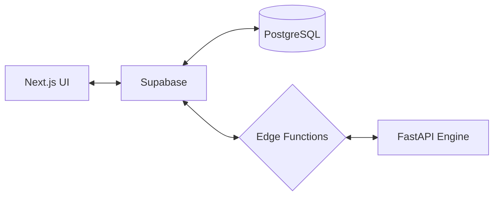

# 🏗️ Modern System Architecture & Module Design

**อัปเดต:** เมษายน 2569
**เป้าหมาย:** ระบบจำแนกหมวดหมู่สินค้าไทยประสิทธิภาพสูง (Hybrid AI)

---

## 📐 Overview

ระบบถูกออกแบบมาให้เป็น **Data-Centric Service-Oriented Architecture** โดยแยกส่วนการแสดงผล (Frontend), การจัดการข้อมูล (Database/Backend), และการประมวลผล AI (Engine) ออกจากกันอย่างชัดเจน

---

## 🔌 1. Presentation Layer (taxonomy-app)

พัฒนาด้วย **Next.js 14+** (App Router) และ **TypeScript**

### **โมดูลสำคัญ:**
- **Import Wizard:** จัดการการนำเข้าไฟล์ CSV (รองรับไฟล์ชื่อไทยผ่านการ Sanitization ก่อน Upload)
- **Taxonomy Manager:** จัดการโครงสร้างหมวดหมู่สินค้าแบบ Tree Structure
- **Review Interface:** หน้าจอสำหรับให้ Human Reviewer ยืนยันผลลัพธ์จาก AI
- **Feedback Loop:** ส่งข้อมูลการ Approve/Reject กลับไปยังระบบเพื่อสร้าง Keyword Rules อัตโนมัติ

---

## 🌩️ 2. Logic Layer (Supabase Edge Functions)

ใช้ **Deno Runtime** ในการรัน Serverless Functions ซึ่งเป็นจุดรวมของ Business Logic ทั้งหมด

### **หลักการออกแบบ:**
- **Edge Function First:** Logic สำหรับการ Classification, Search และ Deduplication ต้องอยู่ที่นี่
- **Stateless:** ไม่เก็บสถานะในตัวฟังก์ชัน แต่ดึงจาก DB หรือ AI Engine แทน
- **Local Proxy:** ทำหน้าที่เป็น Proxy ระหว่าง Frontend และ FastAPI AI Engine

---

## 🧠 3. AI Engine Layer (api_server.py)

พัฒนาด้วย **FastAPI** เพื่อประสิทธิภาพสูงสุดในการประมวลผล Vector

### **โมดูลภายใน:**
- **Embedding Provider:** โหลดโมเดล `paraphrase-multilingual-MiniLM-L12-v2` ครั้งเดียวและให้บริการผ่าน REST API
- **Thai Text Processor:** จัดการความสะอาดข้อความภาษาไทย (Normalize, Tokenize)
- **Attribute Extractor:** ดึงข้อมูลคุณสมบัติ (ขนาด, สี, หน่วย) ออกจากชื่อสินค้า

---

## 🗄️ 4. Data Layer (Supabase PostgreSQL)

ใช้ **PostgreSQL** พร้อมส่วนขยาย **pgvector**

### **คุณสมบัติหลัก:**
- **Vector Storage:** เก็บ embeddings (384-dim) ของทั้งสินค้าและหมวดหมู่
- **Similarity Search:** ใช้ Operator `<=>` (Cosine Distance) ในการค้นหาสินค้าที่คล้ายกันโดยตรงใน SQL
- **Hybrid Matching:** ใช้ SQL ร่วมกับ GIN Index บนคอลัมน์ `keywords` เพื่อทำ Keyword Matching ประสิทธิภาพสูง

---

## 🔄 Data Processing Pipeline

1.  **Normalization:** ล้างอักขระพิเศษ, แปลงเลขไทย, จัดการสระลอย/สระจม
2.  **Tokenization:** ตัดคำภาษาไทยเพื่อหา Keywords
3.  **Embedding:** เปลี่ยนชื่อสินค้าเป็น Vector 384 มิติผ่าน FastAPI
4.  **Scoring (Hybrid Algorithm):**
    - **Keyword Score (60%):** นับจำนวนคำที่ตรงกับ `keyword_rules` หรือ `taxonomy_nodes.keywords`
    - **Vector Score (40%):** คำนวณความใกล้เคียงของ Vector สินค้ากับ Vector ประจำหมวดหมู่
5.  **Final Decision:** หากคะแนนรวม > 0.80 ระบบจะ Auto-Approve (หรือตามค่า Config)

---

## 🧪 Testing & Validation

- **Unit Tests:** ทดสอบ Thai Text Processing และ Scoring Logic ใน Python (Pytest)
- **Integration Tests:** ทดสอบการเชื่อมต่อระหว่าง Next.js และ Edge Functions
- **Visual Integrity:** ใช้ **Domscribe** ตรวจสอบการแสดงผลภาษาไทยบน UI ตามกฎ Antigravity
- **Accuracy Benchmark:** รักษาค่า F1-score ไม่ต่ำกว่า 72%

---

**🏗️ สถาปัตยกรรมนี้เน้นความยืดหยุ่นและการทำงานที่สอดประสานกันระหว่าง AI และ Human Feedback**
