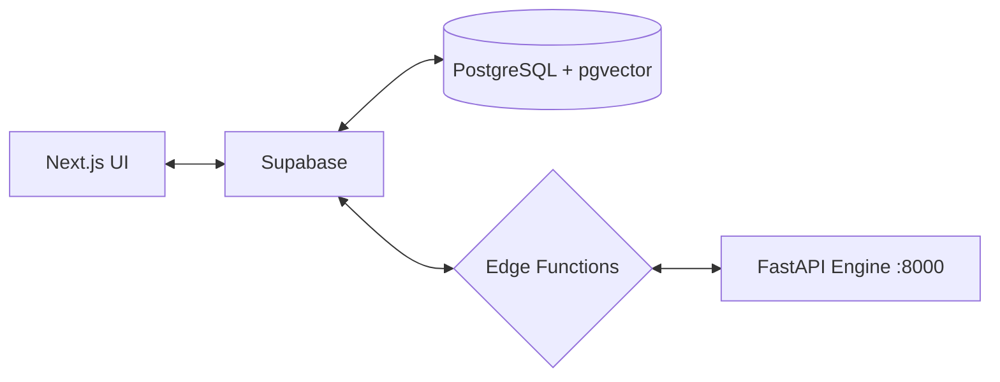

# 🏗️ Modern System Architecture & Module Design (Updated v3.0)

**สถานะปัจจุบัน:** ใช้งานจริง (Verified 16 เมษายน 2569)
**กฎเหล็ก:** ต้องรักษาความแม่นยำ (Accuracy) ไม่ต่ำกว่า 72% ตาม [GEMINI.md](../../GEMINI.md)

---

## 📐 Overview

ระบบทำงานแบบ **Hybrid Intelligence** ที่ผสมผสานความแม่นยำของกฎ (Rules) และความฉลาดของ AI (Vector) เข้าด้วยกัน

```mermaid
graph LR
    UI[Next.js UI] <--> SUPA[Supabase]
    SUPA <--> DB[(PostgreSQL + pgvector)]
    SUPA <--> EDGE{Edge Functions}
    EDGE <--> AI[FastAPI Engine :8000]
```

---

## 🧠 1. Hybrid Scoring Logic (The 60/40 Rule)

หัวใจของระบบคือการคำนวณคะแนนผสม (Hybrid Score) เพื่อลดข้อผิดพลาด:

1.  **Keyword Score (60% weight)**: 
    *   ใช้ระบบนับคำสำคัญจาก `keyword_rules` และ `taxonomy_nodes.keywords`
    *   ถ้าเจอคำที่ตรงเผง (Exact Match) จะได้รับคะแนนส่วนนี้เป็นหลัก
2.  **Embedding Score (40% weight)**:
    *   แปลงชื่อสินค้าเป็น Vector 384 มิติผ่าน FastAPI (`/api/embed`)
    *   คำนวณความใกล้เคียงเชิงความหมาย (Cosine Similarity) ใน PostgreSQL

---

## 🚦 2. Decision Thresholds (เกณฑ์การตัดสินใจ)

ระบบใช้เกณฑ์ความเข้มงวดสูงเพื่อให้มั่นใจในข้อมูล:

*   **Auto-Approve (> 0.90)**: AI มั่นใจสูงมาก ระบบจะใส่หมวดหมู่ให้ทันที
*   **Needs Review (0.70 - 0.89)**: AI มั่นใจปานกลาง จะส่งเข้า Review Queue ให้คนตรวจ
*   **Low Confidence (< 0.70)**: AI ไม่มั่นใจ หรือไม่พบสินค้าที่ใกล้เคียง

---

## 🛠️ 3. Key Components

*   **FastAPI (Port 8000)**: ทำหน้าที่เป็น "Embedding Provider" ส่ง Vector 384-dim ให้ระบบ
*   **Supabase Edge Functions**: เป็น "สมองกลาง" ที่รวมผลคะแนนจาก Keyword และ Vector
*   **Deduplication Pipeline**: สคริปต์ `complete_deduplication_pipeline.py` สำหรับรันงาน Batch และสอน AI (Machine Learning Feedback)

---

**🏗️ สถาปัตยกรรมนี้ถูกปรับปรุงเพื่อรองรับการขยายตัวของข้อมูลสินค้าไทยกว่า 3,000+ รายการ**
